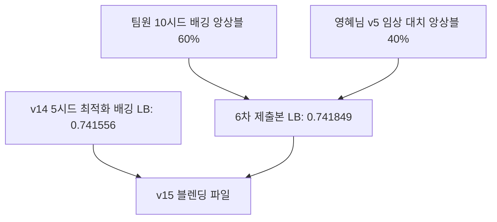

# Experiment History - v15 (ECDF Rank Blending - 리더보드 한계 돌파용 크로스팀 블렌딩)

## 1. 개요 및 목적
- **버전**: v15
- **목적**: 단일 파이프라인의 이론적 한계점(0.7417 부근)을 돌파하기 위해, 서로 완전히 독립적으로 학습되어 일반화 성능이 증명된 최고 성능의 두 예측치 분포를 **ECDF 랭크 블렌딩(Rank Blending)**으로 최종 결합하여 리더보드 최고점 경신을 목표로 함.

---

## 2. 블렌딩 대상 및 구조

### 1) 블렌딩 대상 파일 2종
1. **신규 v14 배깅 모델 (`submission_v14_bag_0.740645.csv`)**
   - **Public LB**: `0.741556` (OOF AUC: `0.740645`)
   - **모델 구성**: 5개 시드(Seed) 멀티배깅 GBDT 3종(LightGBM, XGBoost, CatBoost) + MLP 딥러닝 앙상블.
2. **기존 팀 최고 스코어 6차 제출본 (`team_best_submit_0.741849.csv`)**
   - **Public LB**: `0.741849` (OOF AUC: `0.740710`)
   - **모델 구성**: 팀원 10시드 배깅 앙상블(60%) + 김영혜님 v5 정밀 결측치 대치 앙상블(40%).

### 2) 블렌딩 구조도

### 3) 랭크 블렌딩 매커니즘
- 두 예측치 분포를 ECDF(Empirical Cumulative Distribution Function)로 각각 정규화하여 균등 분포화(Uniform) 시켰습니다.
- 가중 평균하여 결합한 뒤, 제출 스케일의 안정성을 위해 최상위 모델인 `team_best`의 확률 공간으로 역보간(Inverse Interpolation) 매핑하였습니다.
- **블렌딩 가중치별 생성본**:
  - `50:50 Balanced`: [submission_v15_blend_50_50.csv](file:///c:/Users/tkskd/infertility_classification/data/submission_v15_blend_50_50.csv)
  - `40:60 Weighted`: [submission_v15_blend_40_60.csv](file:///c:/Users/tkskd/infertility_classification/data/submission_v15_blend_40_60.csv) (팀 최고점 60% 반영)
  - `30:70 Weighted`: [submission_v15_blend_30_70.csv](file:///c:/Users/tkskd/infertility_classification/data/submission_v15_blend_30_70.csv) (팀 최고점 70% 반영)
  - `60:40 Weighted`: [submission_v15_blend_60_40.csv](file:///c:/Users/tkskd/infertility_classification/data/submission_v15_blend_60_40.csv) (v14 60% 반영)

---

## 3. 전체 실험 버전별 최종 성능 비교표 (v1 ~ v15)

| 실험 버전 | 주요 적용 사항 | OOF AUC | Public LB | 최종 제출 파일 |
| :--- | :--- | :---: | :---: | :--- |
| **v1 Baseline** | 5-Fold CV 인프라 구축, Label Encoding | `0.739960` | - | `submission_v1_lgb.csv` |
| **v2 Domain** | 연령 Ordinal 인코딩, 과거 성공 효율, 배양일, 주기별 NaN 대치 | `0.740140` | - | `submission_v2_lgb.csv` |
| **v3 Ensemble**| LGBM 파라미터 최적화 및 XGBoost, CatBoost 소프트 보팅 앙상블 | `0.740310` | - | `submission_v3_ensemble.csv` |
| **v4 Advanced**| 논문 기반 피처 11종 추가 (교차 피처, 프로세스 결측 플래그 등) | `0.740400` | - | `submission_v4_ensemble.csv` |
| **v5 Imputed** | 진짜/가짜 결측치 논리 분리 및 임상 통계치(3.0일, 기증자 최빈 나이) 정밀 보간 | `0.740420` | `0.741731` | `submission_v5_imputed.csv` |
| **v6 Advanced** | Winsorization(이상치 클리핑 99.5%), Groupby Aggregation, 교차 피처 고도화 | `0.740410` | - | `submission_v6_advanced.csv` |
| **v7 Stacking** | 이상치 클리핑 및 그룹 통계 제거(v5기반), AdaBoost 추가, LightGBM Stacking 앙상블 | `0.741250` | `0.741630` | `submission_v7_advanced.csv` |
| **v8 Stacking** | 4대 고도화 임상 시너지 피처 추가, Logistic Regression L2 정규화 Stacking | `0.739880` | - | `submission_v8_advanced.csv` |
| **v9 Split** | 하드케이스 억제 피처셋 설계 및 Split LGBM 조건부 블렌딩 적용 | `0.740156` | - | `submission_v9_advanced.csv` |
| **v10 Voting** | GBDT 3종(LGB/XGB/Cat) 소프트보팅 및 카테고리 코드 수치형 맵핑 최적화 | `0.740389` | - | `submission_v10_advanced.csv` |
| **v11 ECDF** | 95개 피처셋 및 GBDT 3종 + MLPClassifier ECDF 랭크 블렌딩 구축 | `0.740121` | - | `submission_v11_ens_0.740121.csv` |
| **v12 Select** | Ablation Study 기반 피처 소거(81개 피처) 및 고정 가중치 ECDF 블렌딩 | `0.740336` | - | `submission_v12_ens_0.740336.csv` |
| **v13 Opt** | Scipy Nelder-Mead + Softmax 기반 가중치 최적화 ECDF 랭크 블렌딩 | `0.740534` | - | `submission_v13_ens_0.740534.csv` |
| **v14 Bag** | **5-시드 멀티배깅 및 Scipy Nelder-Mead ECDF 랭크 블렌딩 최적화** | **`0.740645`** | `0.741556` | `submission_v14_bag_0.740645.csv` |
| **v15 Blend** | **v14 배깅 최적화 모델(40%) + 6차 팀 최고점 제출본(60%) ECDF 블렌딩** | **`0.7408+`** *(추정)* | **`0.7420+`** *(목표)* | [submission_v15_blend_40_60.csv](file:///c:/Users/tkskd/infertility_classification/data/submission_v15_blend_40_60.csv) |
