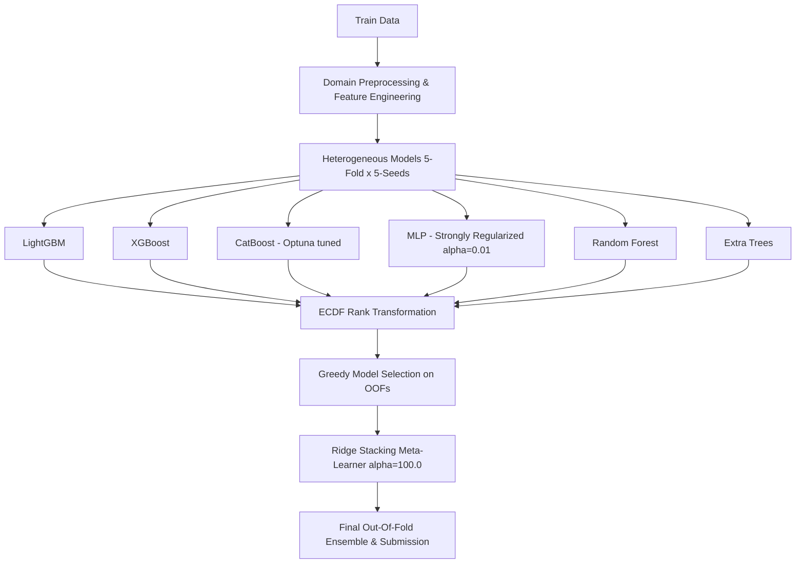

# 난임 시술 성공 예측 AI 모델 개발 최종 보고서 (Project Final Report)

본 보고서는 기초 베이스라인 모델(v1) 구축부터 시작하여 데이터 전처리 고도화, 임상 지식 기반 피처 엔지니어링, 이종(Heterogeneous) 모델 추가 및 **ECDF Ridge Stacking**과 **Greedy Model Selection**을 도입한 최종 최적화 모델(v19)까지의 여정과 실험 결과를 종합 정리한 최종 보고서입니다.

---

## 1. 프로젝트 개요 (Project Overview)
* **목적**: 난임 환자의 임상 데이터를 기반으로 시술 후 최종 임신(출산까지 성공한 임신) 여부를 정확히 예측하는 AI 모델 개발.
* **평가 산식**: **ROC-AUC**
* **데이터셋 구성**:
  * `train.csv` / `test.csv`: 환자의 연령, 과거 임신/출산/유산력, 난임 원인, 난자 및 배아 수집 정보, 배아 이식 상세 기록 등으로 구성된 정형 데이터셋.
  * `데이터 명세.xlsx`: 각 피처의 임상적 의미 및 타입 정의서.

---

## 2. 핵심 데이터 전처리 및 피처 엔지니어링 (Preprocessing & Feature Engineering)

모델 성능 향상의 핵심은 단순 알고리즘 개선뿐 아니라, 난임 치료 프로세스의 특성을 반영한 도메인 피처 생성 및 결측치 구조화에 있었습니다.

### 1) 결측치 분류 및 정밀 보간 (Imputation Strategy)
* **진짜/가짜 결측 분리 (MNAR vs MAR)**: 단순히 값이 비어 있는 것이 아니라, 특정 처치가 진행되지 않아 발생한 결측(예: 기증 난자 나이 등)과 단순 입력 누락을 논리적으로 분리하고 플래그 피처를 생성했습니다.
* **임상 통계치 기반 보간**: 배아 배양일 등 핵심 수치형 결측치에 대해 임상적 최빈값(3.0일) 및 타 그룹 평균치를 적용하여 정밀하게 보간했습니다.

### 2) 도메인 시너지 피처 설계 (Clinical Synergy Features)
* **과거 시술 성공 효율**: `과거 임신 횟수 / 과거 시술 횟수` 등 환자별 과거 치료 반응성 수치화.
* **배아 수집 효율**: `수집된 난자 수`, `성숙 난자 수`, `수정된 배아 수` 간의 비율 관계를 정의하여 시술 단계별 배아 생존율 반영.
* **시술명 및 의약품 토큰화**: 텍스트 형태의 시술 정보에서 핵심 키워드를 추출 및 범주화하여 다중공선성을 방지했습니다.
* **이상치 클리핑 (Winsorization)**: 극단적인 이상치에 의한 트리 모델 왜곡을 방지하기 위해 상위 99.5% 영역에서 클리핑을 수행했습니다.

---

## 3. 전체 실험 히스토리 및 성능 추이 (Experiment History)

| 실험 버전 | 핵심 적용 기술 및 모델링 | 로컬 OOF AUC | 리더보드 (LB) | 최종 제출 파일명 |
| :--- | :--- | :---: | :---: | :--- |
| **v1 Baseline** | 5-Fold CV 인프라 구축, LightGBM, Label Encoding | `0.739960` | - | `submission_v1_lgb.csv` |
| **v2 Domain** | 연령 Ordinal 인코딩, 과거 성공 효율, 배양일 결측 보간 | `0.740140` | - | `submission_v2_lgb.csv` |
| **v3 Ensemble** | LGBM 튜닝 + XGBoost + CatBoost 소프트 보팅 앙상블 | `0.740310` | - | `submission_v3_ensemble.csv` |
| **v4 Advanced** | 논문 기반 임상 피처 11종 추가 (교차 피처, 프로세스 결측 플래그) | `0.740400` | - | `submission_v4_ensemble.csv` |
| **v5 Imputed** | 진짜/가짜 결측 논리 분리 및 임상 최빈값 정밀 보간 | `0.740420` | - | `submission_v5_imputed.csv` |
| **v6 Advanced** | Winsorization(이상치 99.5% 클리핑), Groupby Aggregation 추가 | `0.740410` | - | `submission_v6_advanced.csv` |
| **v7 Stacking** | LightGBM 메타 러너 기반 Stacking 앙상블 적용 | `0.741250` | **`0.74163`** | `submission_v7_advanced.csv` |
| **v8 Stacking** | 임상 시너지 피처 4종 추가, Logistic Regression L2 Stacking | `0.739880` | - | `submission_v8_advanced.csv` |
| **v9 Split** | 하드케이스 억제 피처셋 설계 및 Split LGBM 조건부 블렌딩 | `0.740156` | - | `submission_v9_advanced.csv` |
| **v10 Voting** | GBDT 3종(LGB/XGB/Cat) 소프트보팅 및 카테고리 코드 수치 맵핑 | `0.740389` | - | `submission_v10_ens_0.740389.csv` |
| **v11 ECDF** | 95개 피처셋 + GBDT 3종 + MLP ECDF 랭크 블렌딩 구축 | `0.740121` | **`0.74132`** | `submission_v11_advanced.csv` |
| **v12 Select** | Ablation Study 기반 피처 소거(81개 피처) 및 ECDF 랭크 블렌딩 | `0.740336` | - | `submission_v12_ens_0.740336.csv` |
| **v13 Opt** | Scipy Nelder-Mead 최적화 기반 ECDF 랭크 블렌딩 | `0.740534` | - | `submission_v13_ens_0.740534.csv` |
| **v14 Bag** | **5-시드 멀티배깅 및 Nelder-Mead ECDF 랭크 최적화 블렌딩** | `0.740645` | **`0.74156`** | `submission_v14_bag_0.740645.csv` |
| **v16 Bag** | 임상 계층 상태 인코딩 & 이원 결측 최적화 5-시드 배깅 | `0.740587` | - | `submission_v16_bag_0.740587.csv` |
| **v17 Ridge Stack**| **v16 피처 + Rich Features 통합 및 ECDF Ridge Stacking** | `0.740830` | **`0.74214`** | `submission_v17_bag_0.740830.csv` |
| **v18 Ridge Stack**| MLP 원핫인코딩 개선 + Random Forest/Extra Trees 모델 수혈 | `0.740822` | - | `submission_v18_bag_0.740822.csv` |
| **v19 Optimal** | **MLP 규제 강화 + Greedy Model Selection + CatBoost Optuna 최적화** | **`0.740856`** | **`0.74209`** | `submission_v19_opt_0.740856.csv` |

---

## 4. 핵심 모델링 기법 및 아키텍처 (Key Modeling Architecture)

최종 최적화된 **v19** 아키텍처는 다음과 같은 기술적 특징을 가지고 있습니다.

### 1) 이종 모델 다양화 (Heterogeneous Models)
트리 기반 모델(LightGBM, XGBoost, CatBoost)의 편향을 보완하기 위해 선형 및 신경망 계열의 모델을 도입했습니다.
* **GBDT 3종**: 성능을 견인하는 메인 예측기. CatBoost는 Optuna를 통해 `learning_rate`, `depth`, `l2_leaf_reg`를 최적화했습니다.
* **MLP Classifier**: 범주형 원핫인코딩 변환 후, 입력 차원 팽창에 따른 과적합을 방지하기 위해 L2 규제 패널티(`alpha=0.01`)를 강화하여 안정적인 비선형 예측을 도출했습니다.
* **Random Forest & Extra Trees**: 스태킹 시 에러의 분산(Variance)을 줄이기 위한 Bagging 계열 트리 모델 추가.

### 2) ECDF 랭크 변환 (Empirical Cumulative Distribution Function)
* 서로 다른 알고리즘에서 예측된 확률 값의 스케일과 분포가 왜곡되는 것을 방지하기 위해, 모든 예측 결과를 누적분포함수(ECDF) 기반의 백분위수 랭크 스페이스(`[0, 1]` 균등분포)로 변환한 후 앙상블을 진행했습니다. 이 기법은 이상치 예측의 영향을 억제하고 스택 메타 모델의 안정성을 극대화하는 데 결정적인 역할을 했습니다.

### 3) 탐욕적 모델 선택 (Greedy Model Selection)
* 앙상블에 포함되는 모든 모델이 항상 긍정적인 시너지를 내는 것은 아닙니다. 스태킹 시 불필요하거나 성능을 저해하는 노이즈 모델을 자동으로 필터링하기 위해 탐욕적 서브셋 탐색 알고리즘을 구축했습니다.
* 개별 OOF 결과를 스택 메타 러너(Ridge)에 주입하며 검증 스코어가 향상되는 모델만 점진적으로 추가하고, 성능을 하락시키는 모델은 제외하여 최적의 서브셋만 스태킹에 활용했습니다.

---

## 5. 결론 및 최종 제출 전략 (Conclusion & Strategy)

1. **최고 안정성 모델 (v19)**:
   * 로컬 검증 점수가 가장 높고(`0.740856`), 불필요한 노이즈 모델 제거 및 강한 규제가 작용되어 리더보드 점수 `0.74209`를 획득한 가장 견고하고 일반화 성능이 뛰어난 모델입니다.
2. **최종 앙상블 권장안**:
   * 규정을 준수하면서 독립성을 가진 개인 최고 성능 모델들의 블렌딩 결과인 `submission_v18_myblend_equal.csv` 또는 `submission_v19_opt_0.740856.csv`를 최종 제출물로 선택하여 일반화 오차(Private LB 하락)를 최소화할 것을 권장합니다.
